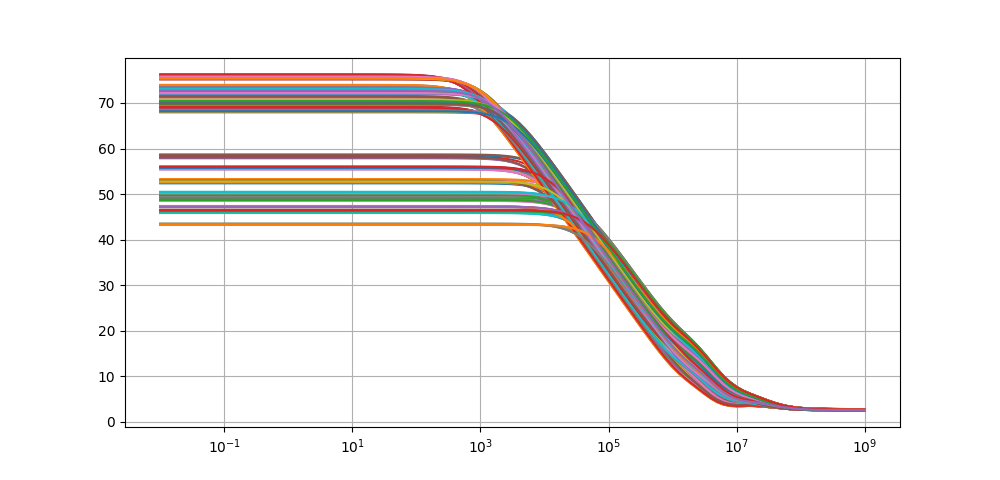
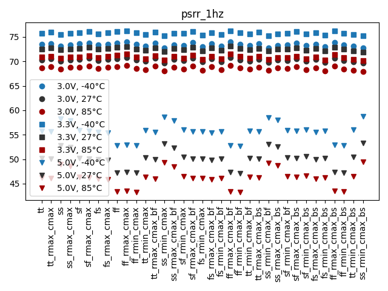
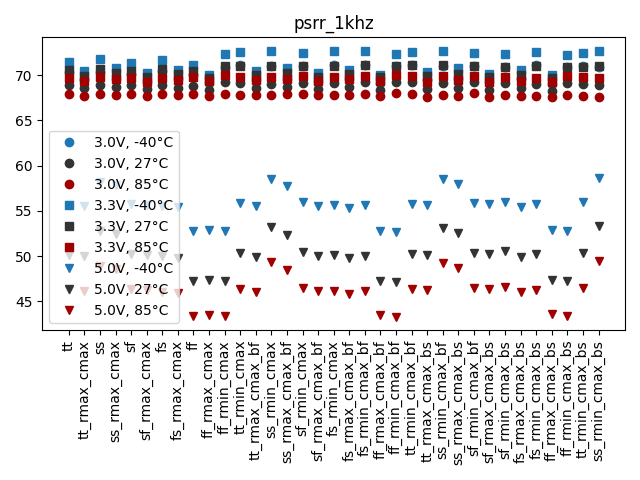
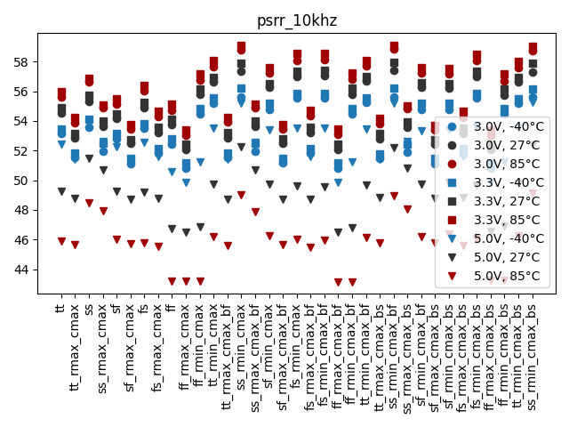
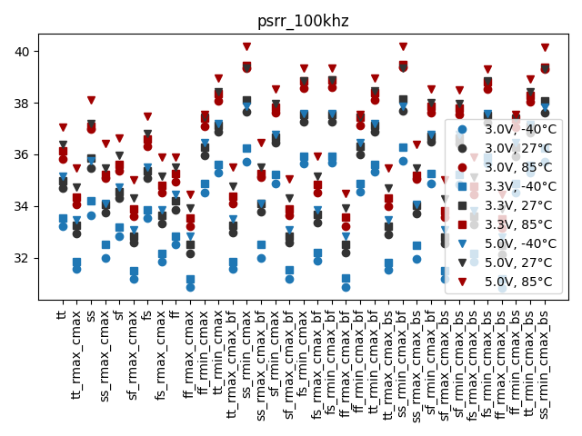

# Simulation Results 

Simulation results for ac_bandgap_psrr

## Pre-Layout Simulation

|             |     min |     max |    mean |      std |
|:------------|--------:|--------:|--------:|---------:|
| psrr_dc     | 43.2743 | 76.2681 | 64.815  | 10.4861  |
| psrr_1hz    | 43.2743 | 76.268  | 64.815  | 10.4861  |
| psrr_1khz   | 43.2731 | 72.7234 | 63.3779 |  9.40062 |
| psrr_10khz  | 43.1398 | 59.1221 | 52.8882 |  3.63072 |
| psrr_100khz | 30.83   | 40.2016 | 35.3806 |  2.22512 |

