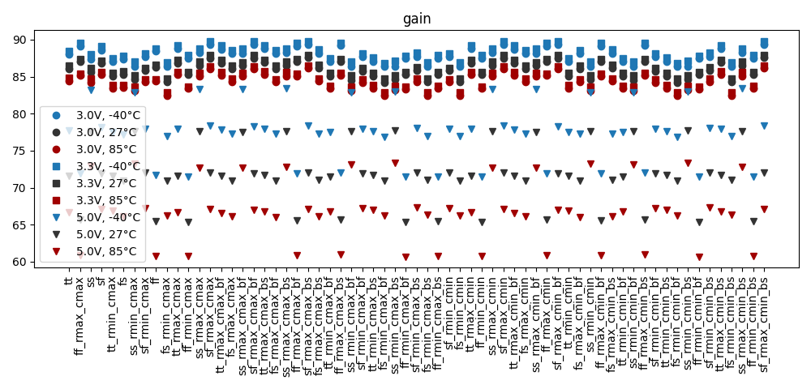
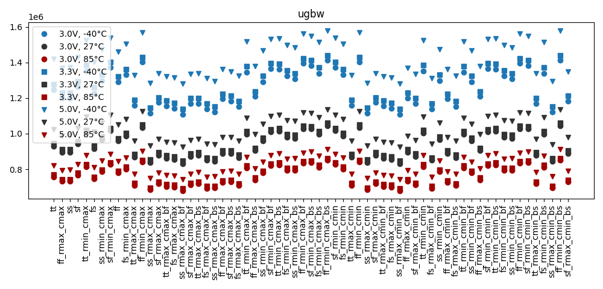
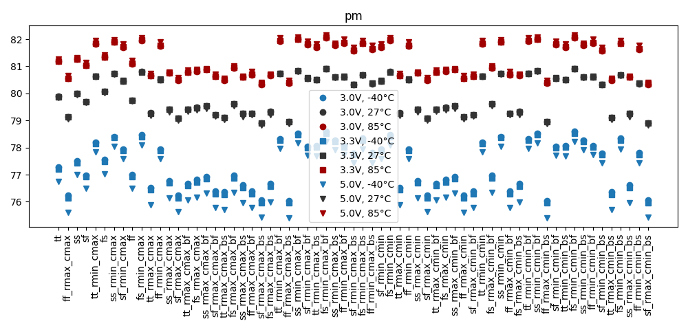
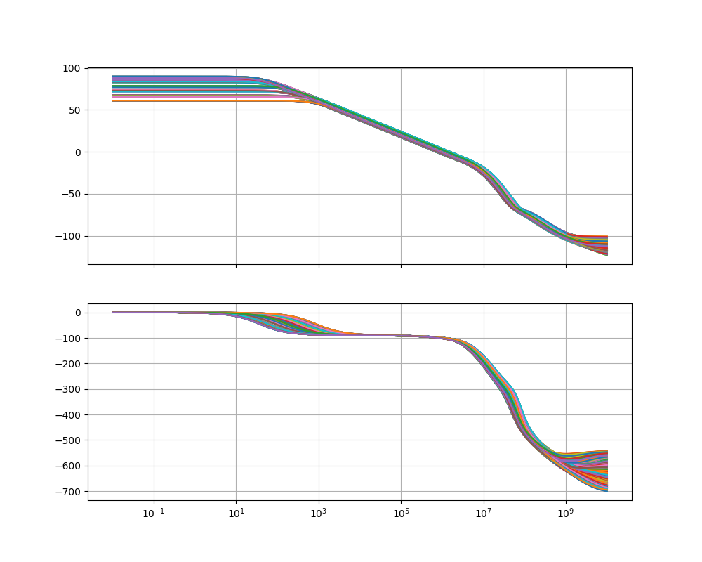

# Simulation Results 

Simulation results for ac_bandgap_stb

## Pre-Layout Simulation

|        | min       | max       | mean      | std       |
|:-------|:----------|:----------|:----------|:----------|
| gain   | 60.67386  | 89.81982  | 81.48283  | 7.65744   |
| ugbw   | 678.7398k | 1.57968M  | 1.02607M  | 240.2428k |
| pm     | 75.4057   | 82.16207  | 79.44465  | 1.86628   |

