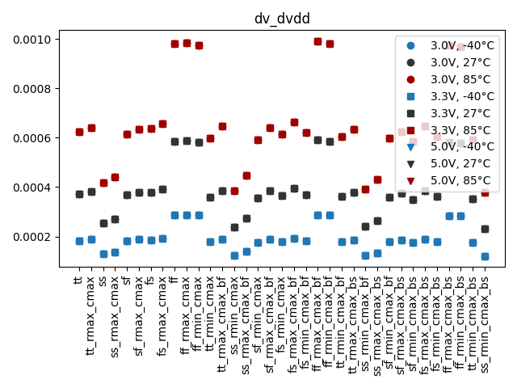
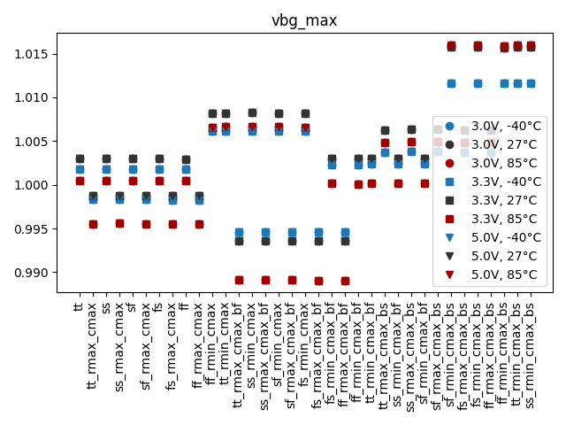
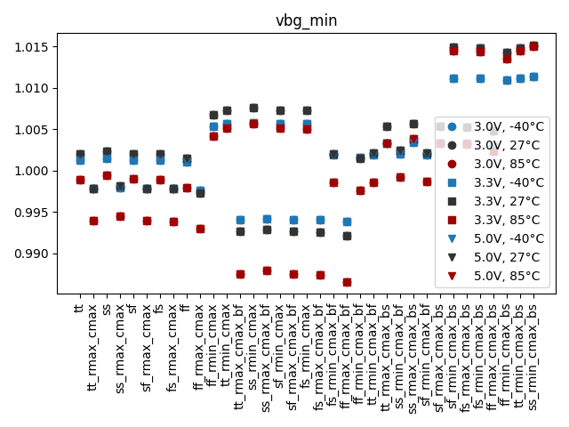

# Simulation Results 

Simulation results for dc_bandgap_supply

## Pre-Layout Simulation

|         | min       | max     | mean     | std       |
|:--------|:----------|:--------|:---------|:----------|
| vbg_min | 986.566m  | 1.01519 | 1.00181  | 6.74978m  |
| vbg_max | 989.0445m | 1.01600 | 1.00284  | 6.67039m  |
| dv_dvdd | 120.4u    | 991.4u  | 411.693u | 226.6034u |

