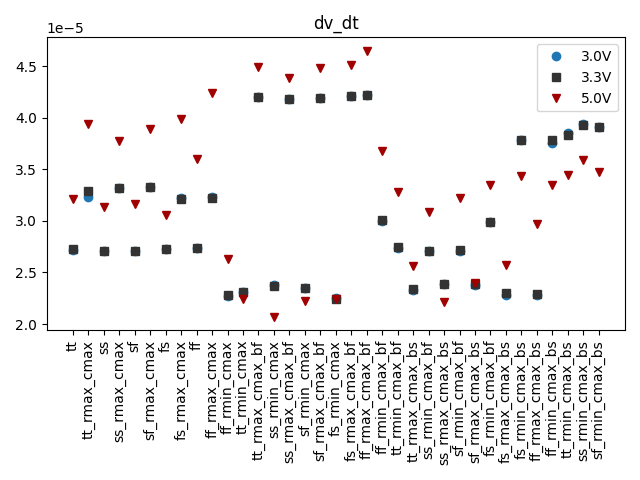
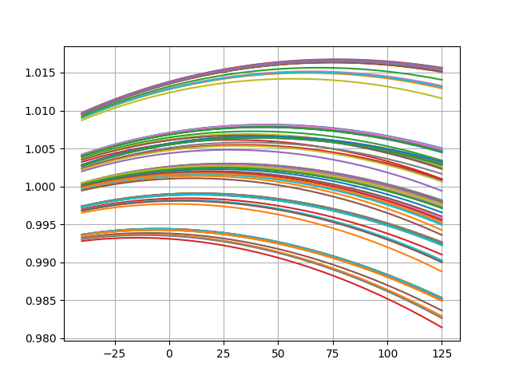
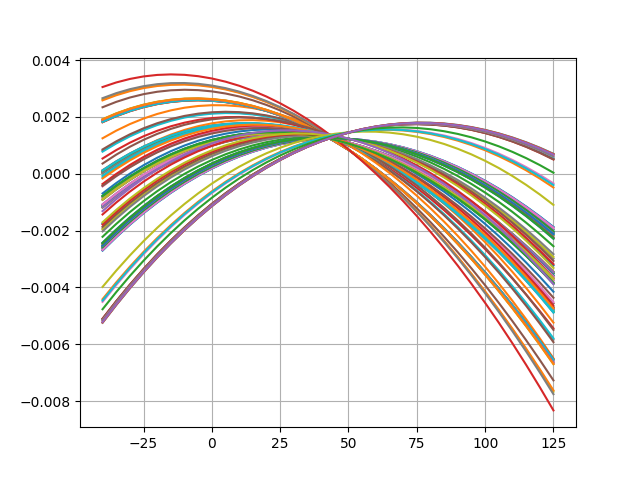

# Simulation Results 

Simulation results for dc_bandgap_temperature

## Pre-Layout Simulation

|       | min       | max       | mean      | std      |
|:------|:----------|:----------|:----------|:---------|
| t_max | -29.1322  | 74.79177  | 26.39307  | 25.46853 |
| t_min | -30.1412  | 74.99048  | 22.38232  | 41.36199 |
| dv_dt | 20.70302u | 46.48845u | 31.59613u | 7.07938u |

