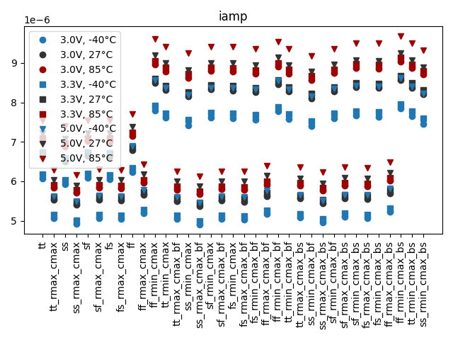
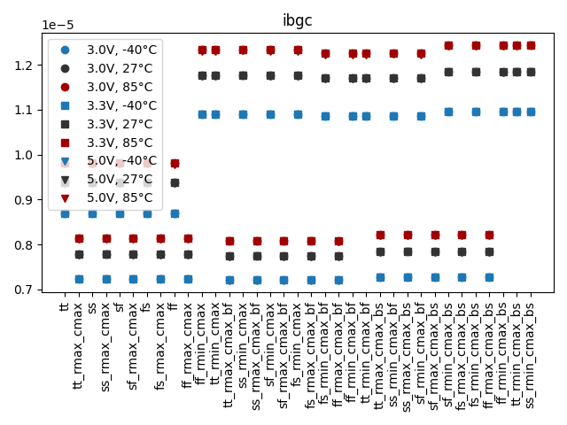
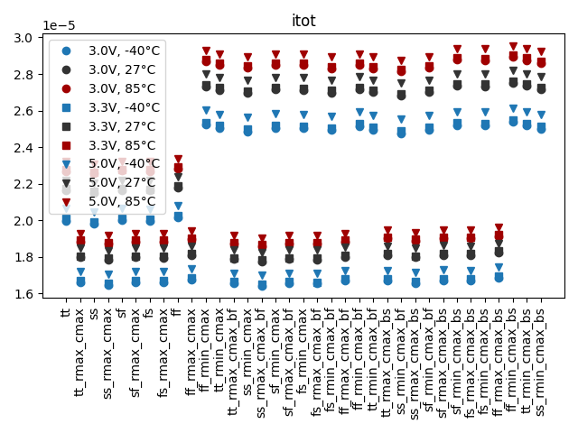
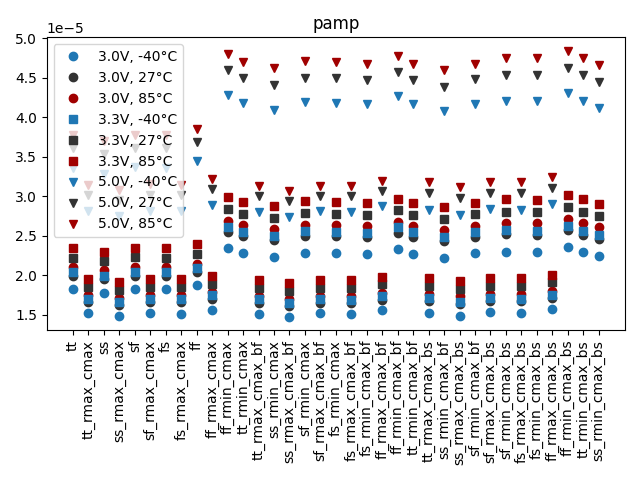
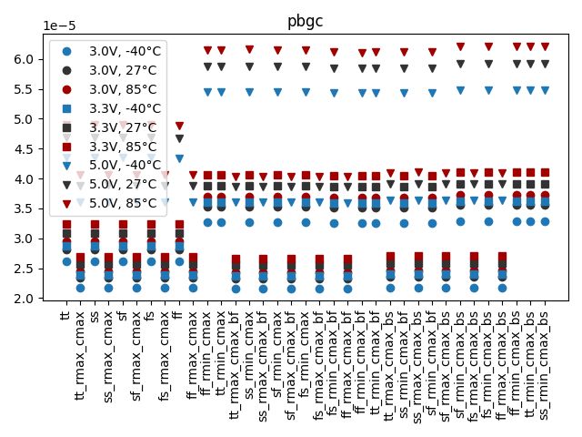
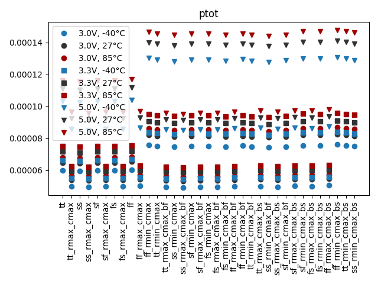

# Simulation Results 

Simulation results for op_bandgap_power

## Pre-Layout Simulation

|      | min       | max       | mean      | std       |
|:-----|:----------|:----------|:----------|:----------|
| iamp | 4.90561u  | 9.68597u  | 7.05185u  | 1.40299u  |
| ibgc | 7.19443u  | 12.44681u | 9.63843u  | 1.89971u  |
| itot | 16.42464u | 29.54914u | 22.46829u | 4.41985u  |
| pamp | 14.71684u | 48.42985u | 26.79417u | 9.11306u  |
| pbgc | 21.60794u | 62.15826u | 36.29921u | 11.20453u |
| ptot | 49.27392u | 147.7457u | 84.85841u | 27.02177u |

