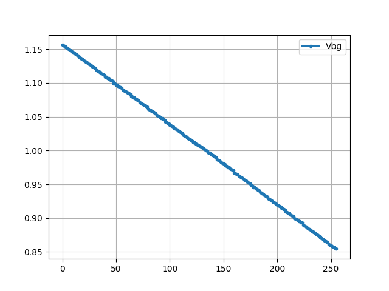
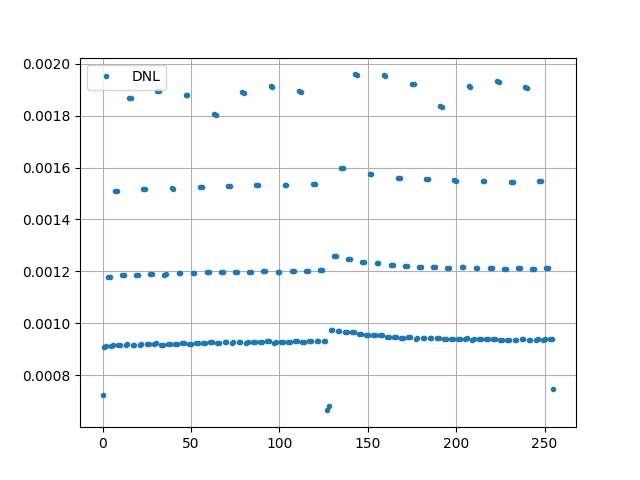

# Simulation Results 

Simulation results for tr_bandgap_trim_ss

## Pre-Layout Simulation

|     |      min |        max |      mean |         std |
|:----|---------:|-----------:|----------:|------------:|
| vbg | 0.854512 | 1.15614    | 1.0061    | 0.0878226   |
| dnl | 0.000665 | 0.00195845 | 0.0011811 | 0.000326729 |

