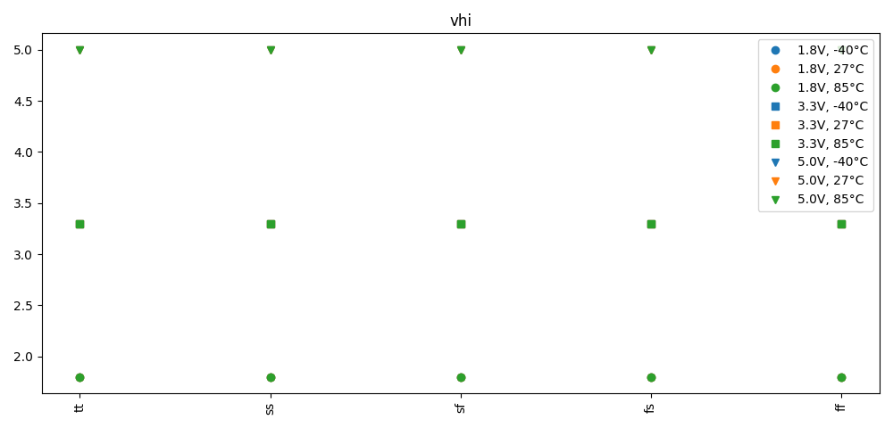
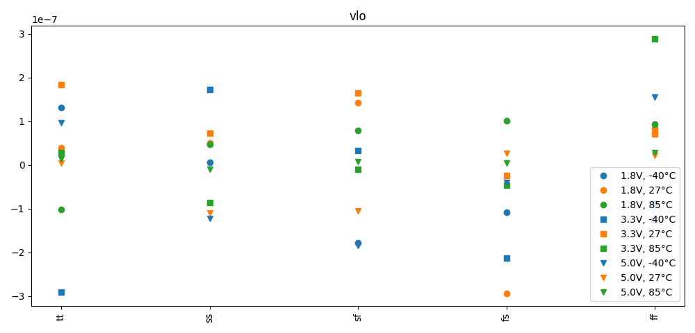
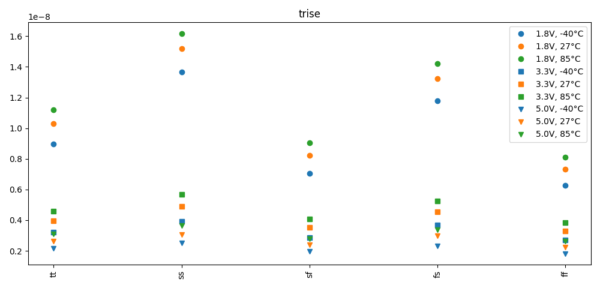
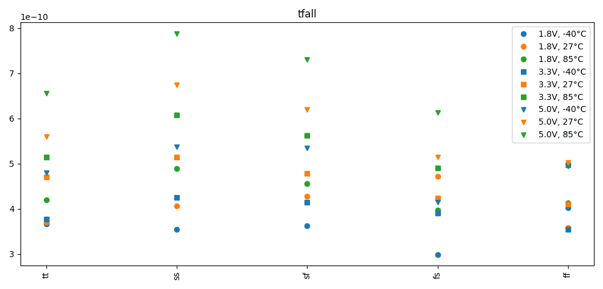

# Simulation Results 

Simulation results for tr_levelshifter

## Pre-Layout Simulation

|         | min       | max       | mean      | std       |
|:--------|:----------|:----------|:----------|:----------|
| vhi     | 1.79999   | 5.0       | 3.36666   | 1.30724   |
| vlo     | -293.603n | 289.3036n | 379.6658p | 122.534n  |
| trise   | 1.819n    | 16.181n   | 5.78693n  | 3.99033n  |
| tfall   | 299.0p    | 788.0p    | 480.3111p | 105.1477p |

