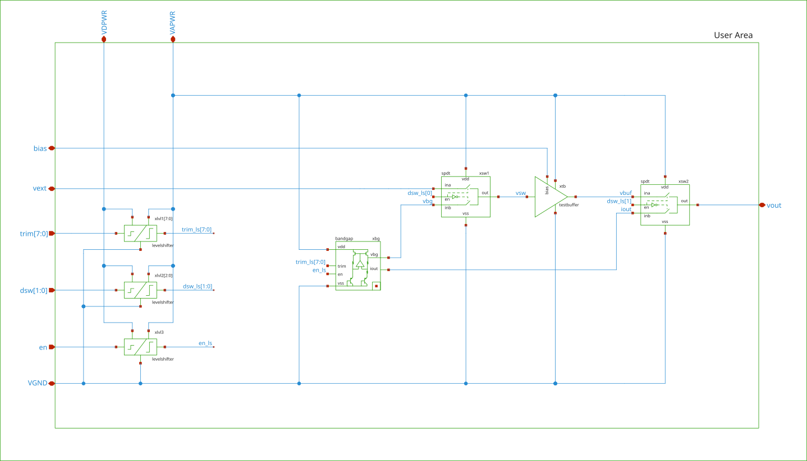

# Current Mode Voltage Reference

## Functional description

The circuit provides a PVT independent 1V reference voltage.
It is self biased, so no external components or bias currents are required. 
VDD and VSS are sufficient to generate the reference voltage.

It features a 8bit trim array to archive better target accuracy. 
It also features a enable signal, such that the circuit can be powered down when not required.


## Target Specifications

| Parameter                    | Symbol.  | Min.  | Typ.   | Max.       | Unit. | Condition                         |
| :--------------------------- | :------- | :---: | :----: | :--------: | :---: | :-------------------------------- |
| Supply Voltage               | Vdda     |  3.0  |  3.3   | 5.0        | V     |                                   |
| Output Voltage               | Vbg      |       |  1     |            | V     |                                   |
| Load Capacitance             | Cl       |       |        | 500        | fF    | To achieve tset                   |
| Area                         | A        |       |        | 180x220    | µm²   |                                   |
| Temperature Range            | T        |  -40  |        | 85         | °C    |                                   |
| Initial Accuracy             | ΔVbgi    | -25   |        | +25        | %     | All PVT, ±3σ yield                | 
| Trimmed Accuracy             | ΔVbgt    | -0.25 | +-0.15 | +0.25      | %     |                                   | 
| Quiesent Current             | Iq       |       |  20    | 30         | µA    | All PVT                           |
| Power-down state Current     | Ioff     |       |        | 10         | nA    | All PVT                           |
| Power Dissipation            | Pd       |       |  66    | 150        | µW    | All PVT                           |
| Temperature coefficient      | Tc       |       |  35    | 85         | µV/°C | All PVT, ±3σ yield                | 
| Line Regulation              | dV/dVdd  |       |  1     | 2          | mV/V  | All PVT                           |
| Line Relative Change         | ΔVvdd    |       |  2     | 4          | mV    | All PVT                           |
| Power Supply Rejection Ratio | PSRR     |  75   |        |            | dB    | f=1Hz, Vdd=3.3V                   |
|                              |          |  60   |        |            | dB    | f=100Hz, Vdd=3.3V                 |   
|                              |          |  40   |        |            | dB    | f=1kHz, Vdd=3.3V                  |
| Noise                        | en       |       |  75    | 80         | µVrms | f=0.1Hz to 10Hz                   |
|                              |          |       |  90    | 100        | µVrms | f=10Hz to 10kHz                   |
| Turn-on settling time        | tset     |       |  8     | 35         | µs    | All PVT, @Cl max, Vbg: +-1% of SS |


## List of I/O 

| Primary I/O      | Direction          | Description               |
| :--------------: | :----------------- | :------------------------ |
| VAPWR            | IO                 | Analog supply voltage     |
| VDPWR            | IO                 | Digital supply voltage    |
| VGND             | IO                 | Supply ground             |
| vbg              | OUT                | Bandgap reference voltage |
| en               | IN                 | Enable signal             |
| trim[7:0]        | IN                 | Digital trim inputs       |

| Test I/O         | Direction          | Description               |
| :--------------: | :----------------- | :------------------------ |
| bias             | IN                 | Testbuffer bias current   |
| vext             | IN                 | External test input       |
| dsw[1:0]         | IN                 | Path selector switches    |


## Schematics

The schematics for the circuit are located in [xschem/sch](../xschem/sch)

## Testbenches and Results

The testbenches are located in [xschem/tb](../xschem/tb).

The following overview shows which testbench is used to simulate which specification.
Some might be duplicate where the same specification is checked using different methods.

For **results** see the individual pages.

| Testbench                                                    | Parameters         |
| :------------------------------------------------------------| :----------------- |
| [op_bandgap](bandgap/op_bandgap.md)                          | operating point    |
| [ac_bandgap_stb](bandgap/ac_bandgap_stb.md)                  | loop stability     |
| [ac_bandgap_psrr](bandgap/ac_bandgap_psrr.md)                | PSRR               |
| [dc_bandgap_supply](bandgap/dc_bandgap_supply.md)            | dV/dVdd, ΔVvdd     |
| [dc_bandgap_temperature](bandgap/dc_bandgap_temperature.md)  | Tc                 |
| [mc_bandgap_temperature](bandgap/mc_bandgap_temperature.md)  | ΔVbgi              |
| [no_bandgap](bandgap/no_bandgap.md)                          | en                 |
| [op_bandgap_power](bandgap/op_bandgap_power.md)              | Iq, Pd             |
| [tr_bandgap_power_off](bandgap/tr_bandgap_power_off.md)      | Ioff               |
| [tr_bandgap_psrr](bandgap/tr_bandgap_psrr.md)                | PSRR               |
| [tr_bandgap_startup](bandgap/tr_bandgap_startup.md)          | tset               |
| [tr_bandgap_supply](bandgap/tr_bandgap_supply.md)            | dV/dVdd, ΔVvdd     |
| [tr_bandgap_temperature](bandgap/tr_bandgap_temperature.md)  | Tc                 |
| [tr_bandgap_trim_ss](bandgap/tr_bandgap_trim_ss.md)          | ΔVbgt              |


## Setup

Prior to running any simulation one should source the cadrc found 
in the xschem folder [xschem/cadrc](../xschem/cadrc).

```
cd xschem
source cadrc
```

Simulation corners and a virtual python environment holding essential tools 
for simulation can be generated simply issuing the make command in the 
[xschem](../xschem) directory.

Make sure environment variables `PDK` and `PDK_ROOT` are set to point to the 
gf180mcuD pdk.

```
cd xschem
make 
```

## Running PVT simulations

1. Setup the environment as described in Setup section above.
2. Source cadrc `source cadrc`
3. Navigate to the testbench tests folder ([tests](../xschem/tb/bandgap_cm/bandgap/tests))
4. Run the recipe .conf file `runtest --configfile="ac_bandgap_stb.conf"`

**Hint**: give `--cores=N` argument to `runtest` to distribute the simulation cases
on multiple cores.

## Test architecture

To test the circuit without changing its characteristics, it's required to include a 
test buffer and switches. 
The configuration allows for characterization of the test buffer itself as a 
standalone component and for the full system, including the voltage reference.



The simulation results for the testbuffer can be found here:

| Testbench                                                    | Parameters         |
| :------------------------------------------------------------| :----------------- |
| [op_tb_amplifier](testbuffer/op_tb_amplifier.md)             | operating point    |
| [ac_tb_amplifier_stb](testbuffer/ac_tb_amplifier_stb.md)     | Avol, UGBW, φm     |
| [ac_tb_amplifier_cin](testbuffer/ac_tb_amplifier_cin.md)     | Cin                |
| [ac_tb_amplifier_cmrr](testbuffer/ac_tb_amplifier_cmrr.md)   | CMRR               |
| [ac_tb_amplifier_psrr](testbuffer/ac_tb_amplifier_psrr.md)   | PSRR+, PSRR-       |
| [dc_tb_amplifier_icmr](testbuffer/dc_tb_amplifier_icmr.md)   | ICMR+, ICMR-       |
| [mc_tb_amplifier](testbuffer/mc_tb_amplifier.md)             | Vos                |
| [no_tb_amplifier](testbuffer/no_tb_amplifier.md)             | en                 |
| [op_tb_amplifier_power](testbuffer/op_tb_amplifier_power.md) | Iq, Pd             |
| [tr_tb_amplifier_slew](testbuffer/tr_tb_amplifier_slew.md)   | SR+, SR-           |
