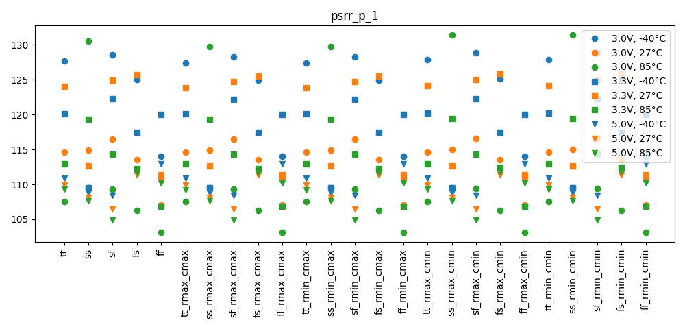
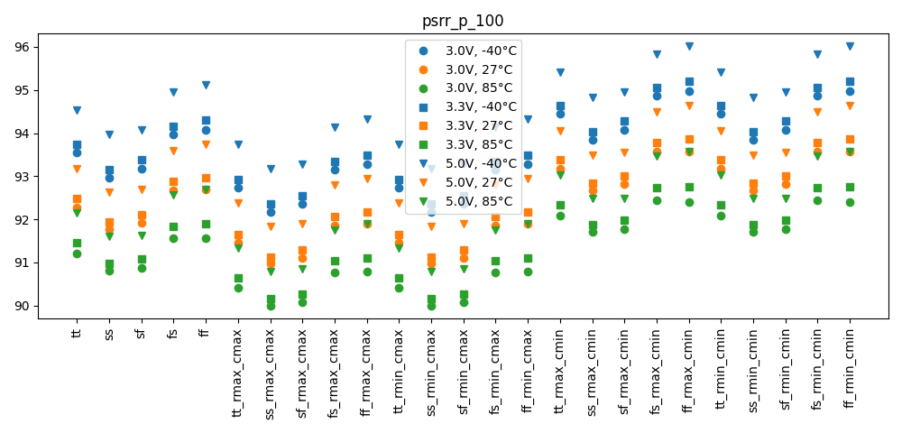
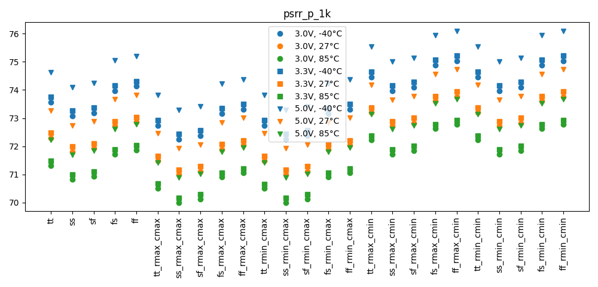
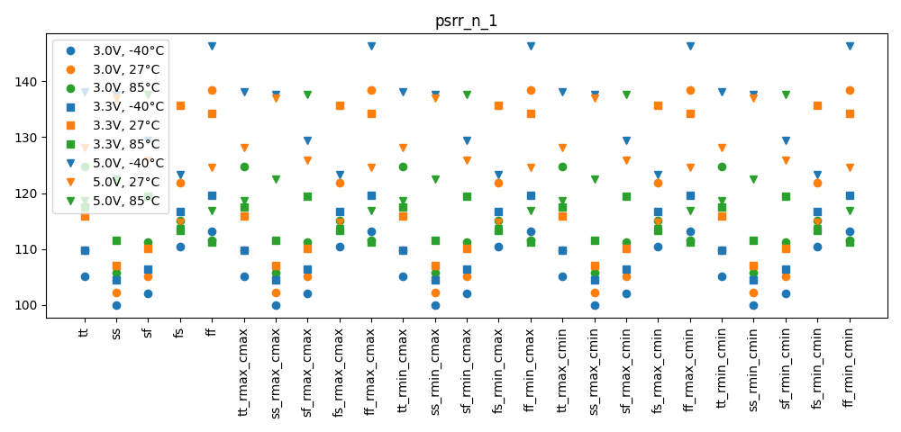
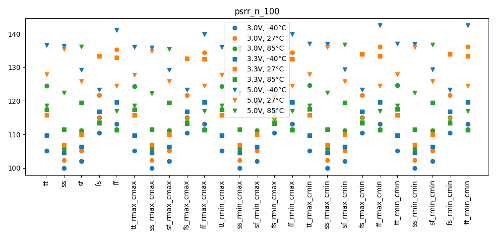
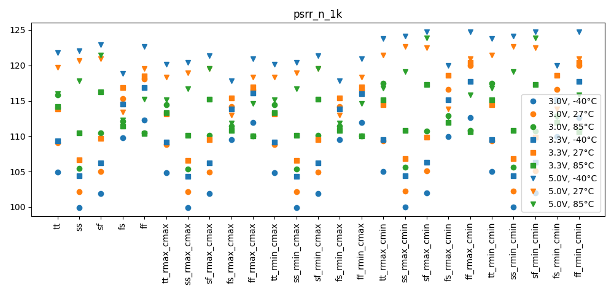

# Simulation Results 

Simulation results for ac_tb_amplifier_psrr

## Pre-Layout Simulation

|            |      min |      max |     mean |      std |
|:-----------|---------:|---------:|---------:|---------:|
| psrr_p_1   | 103.15   | 131.38   | 113.901  |  6.82956 |
| psrr_p_10  | 102.504  | 114.527  | 109.273  |  2.6989  |
| psrr_p_100 |  89.9988 |  96.0099 |  92.7567 |  1.3519  |
| psrr_p_1k  |  69.9988 |  76.0978 |  72.8282 |  1.35747 |
| psrr_p_10k |  49.9988 |  56.0987 |  52.829  |  1.35754 |
| psrr_n_1   |  99.9941 | 146.25   | 118.31   | 11.5976  |
| psrr_n_10  |  99.9941 | 146.19   | 118.304  | 11.586   |
| psrr_n_100 |  99.9934 | 142.449  | 117.871  | 10.865   |
| psrr_n_1k  |  99.9274 | 124.759  | 113.316  |  6.17257 |
| psrr_n_10k |  93.8032 | 106.484  |  99.0141 |  2.54145 |

