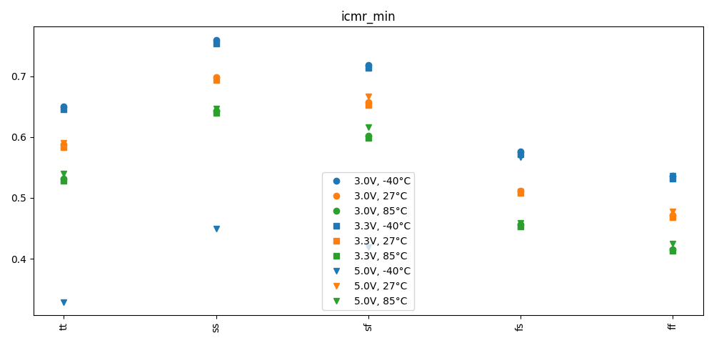
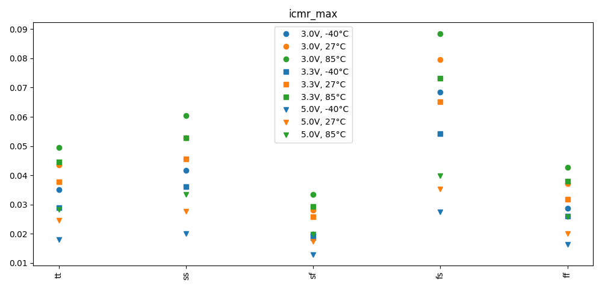

# Simulation Results 

Simulation results for dc_tb_amplifier_icmr

## Pre-Layout Simulation

|          | min       | max       | mean      | std       |
|:---------|:----------|:----------|:----------|:----------|
| vin_min  | 328.8146m | 759.9463m | 566.7406m | 102.0405m |
| icmr_min | 328.8146m | 759.9463m | 566.7406m | 102.0405m |
| vin_max  | 2.91150   | 4.98706   | 3.72923   | 890.2352m |
| icmr_max | 12.933m   | 88.492m   | 37.43636m | 17.40443m |

