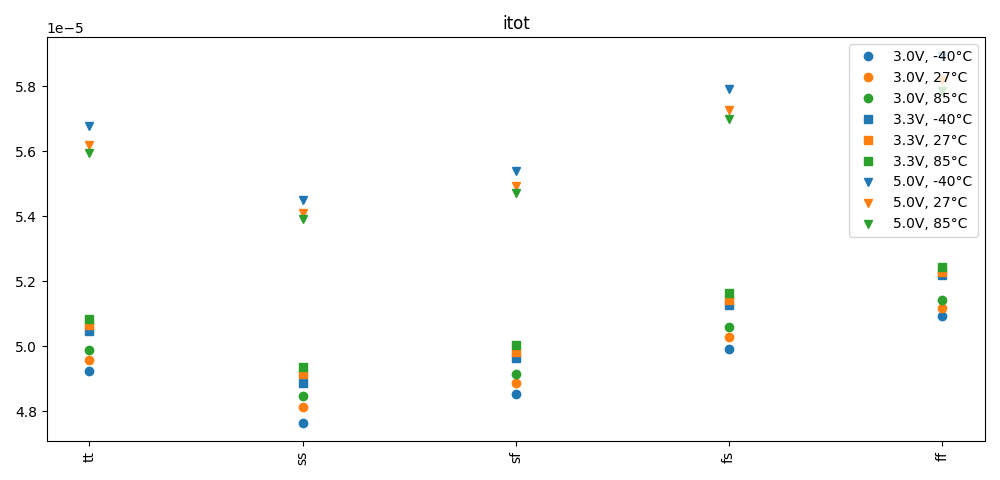
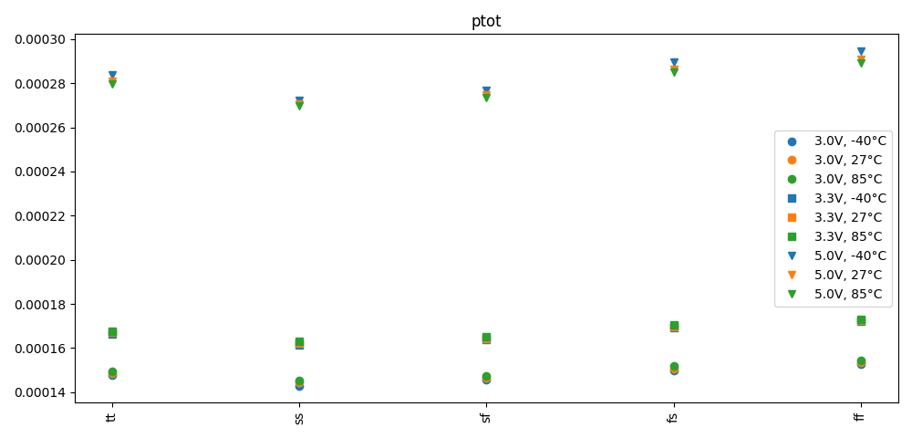

# Simulation Results 

Simulation results for op_tb_amplifier_power

## Pre-Layout Simulation

|         | min       | max       | mean      | std       |
|:--------|:----------|:----------|:----------|:----------|
| id_xm1  | 2.28579u  | 2.84622u  | 2.54057u  | 150.7684n |
| id_xm2  | 2.28558u  | 2.84492u  | 2.53989u  | 150.6269n |
| id_xm4  | 2.28558u  | 2.84524u  | 2.53992u  | 150.6662n |
| id_xmb1 | 4.99999u  | 5.00000u  | 4.99999u  | 1.20779p  |
| id_xm5  | 4.57138u  | 5.69114u  | 5.08039u  | 301.3606n |
| id_xm6  | 32.35317u | 39.14687u | 34.80915u | 1.89415u  |
| id_xm3  | 2.28579u  | 2.84652u  | 2.54057u  | 150.7892n |
| id_xm7  | 33.85321u | 41.64758u | 36.69295u | 2.28729u  |
| id_xmb2 | 4.21708u  | 6.68118u  | 5.38986u  | 647.4807n |
| id_xmb3 | 4.21708u  | 6.68155u  | 5.38996u  | 647.6341n |
| id_xmb4 | 4.21708u  | 6.68154u  | 5.38995u  | 647.6329n |
| itot    | 47.64168u | 58.94192u | 52.1634u  | 3.18924u  |
| ptot    | 142.925u  | 294.7096u | 199.0516u | 58.826u   |

