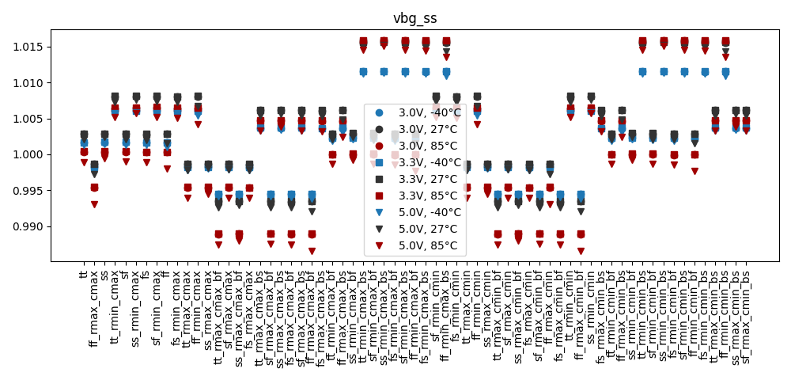
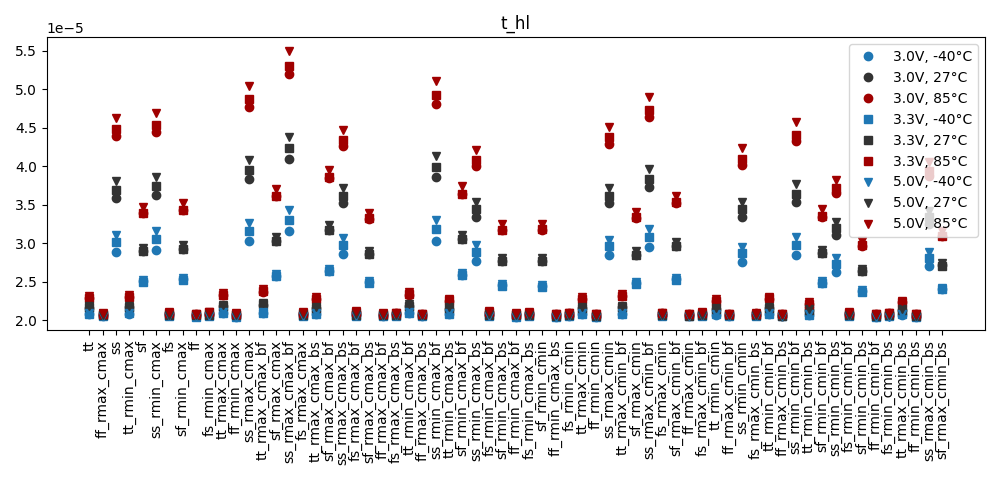
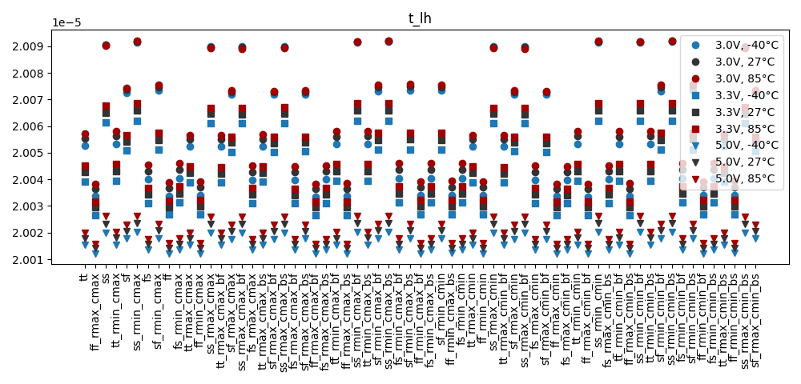
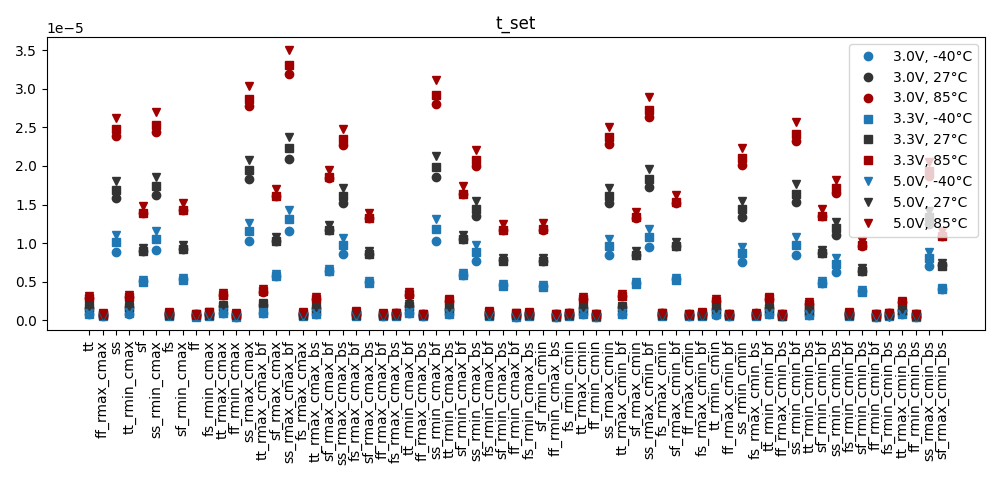
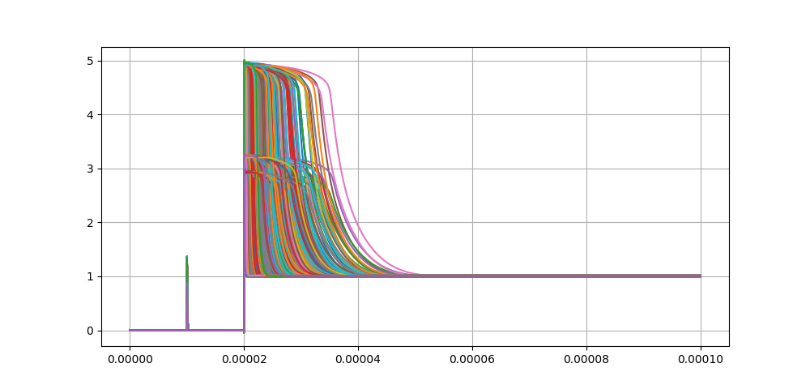

# Simulation Results 

Simulation results for tr_bandgap_startup

## Pre-Layout Simulation

|        | min       | max       | mean      | std       |
|:-------|:----------|:----------|:----------|:----------|
| vbg_ss | 986.566m  | 1.01589   | 1.00251   | 6.94766m  |
| t_hl   | 20.434u   | 54.99363u | 25.93534u | 7.37237u  |
| t_lh   | 20.01217u | 20.09214u | 20.041u   | 22.18047n |
| t_set  | 434.0n    | 34.99363u | 5.93533u  | 7.37237u  |

